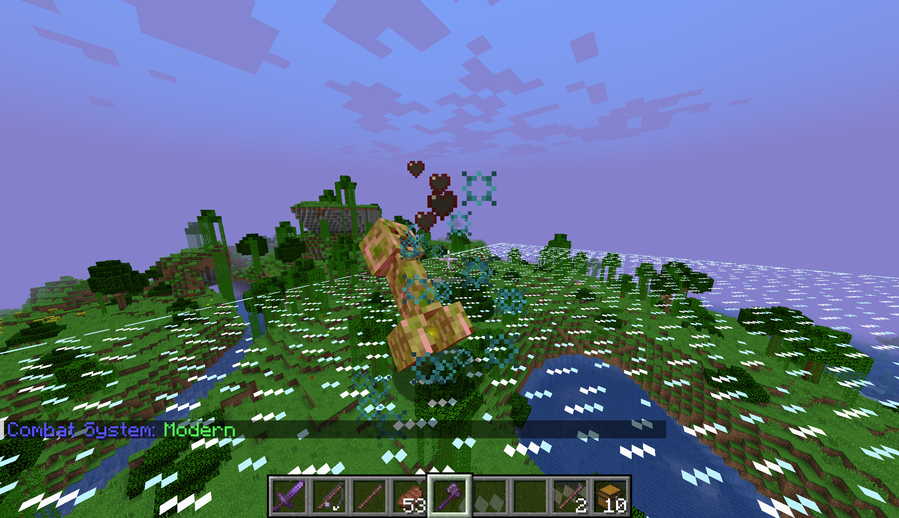
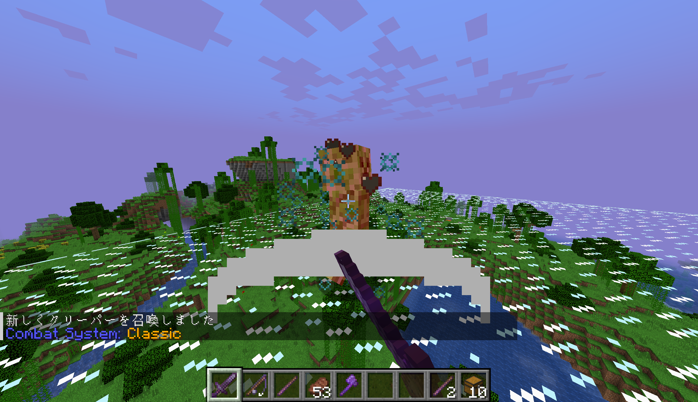
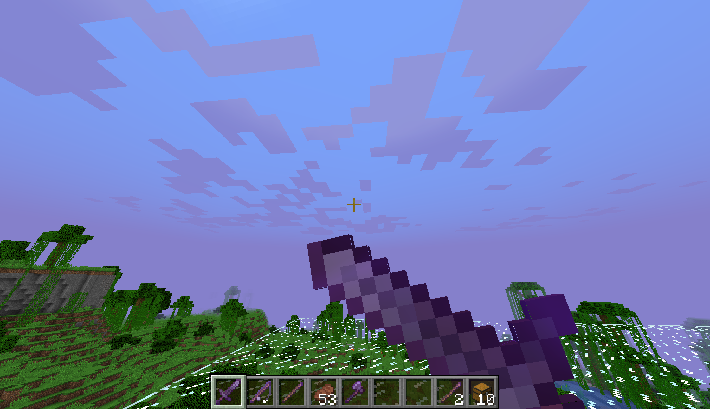

# 戦闘仕様

本サーバーでは、**現在のJava版のクールダウン攻撃**に加え、\
**統合版(旧Java版)のような連打攻撃**の2種類を切り替えて遊ぶことができます！

## 切り替え方
戦闘仕様の切り替え方は**コマンド**で行います！\
`/togglecombat`もしくは`/tc`を使って切り替えましょう！\

ただし、コマンドの実行は、**体力が最大の時**のみにしか実行できません！

---

## それぞれの戦闘仕様の特徴

### 🪓クールダウン攻撃(現在のJava版)
\
Java版バニラと一緒です！
* **チャージ率に応じて与えられるダメージ数が変動**します。
* 剣で範囲攻撃ができます。
* 斧が剣よりダメージが強いです。
* 隠し満腹度を用いて高速回復ができます。

### 🗡連打攻撃(統合版(旧Java版))
\
統合版(旧Java版)のような感覚で戦えます！
* **Java1.9以前・統合版のような連打攻撃**ができます！
* Java1.9以前のような剣によるガードができます！(ON/OFF切り替えれます)
* 剣での範囲攻撃ができません。
* 斧が剣よりダメージが弱いです。
* 隠し満腹度による高速回復ができません。

#### 🛡️剣によるガードについて
\
旧Java版のように剣を右クリックすることで、ガードが発動します！\
盾とは違いクリックした直後から有効になります！\
特定の種類のダメージを50%カットします！

また、剣のガードは無効にすることもできます。
`/toggleblocking`もしくは`/tb`を使って切り替えれます！\
盾や左手に持ってるアイテムを剣を持ちながら使いたい時などは剣ガードを無効化してください！
