# 追加アイテム
## 一覧
### 魔法系
* [Wand of Hello World!](#wand-of-hello-world)
* [Wand of Magic Missile](#wand-of-magic-missile)

### ツール系
* [Grapple](#grapple)

### 素材系
* [Enchanted Coal](#enchanted-coal)
* [Enchanted Coal Block](#enchanted-coal-block)
* [Enchanted Emerald](#enchanted-emerald)
* [Enchanted Emerald Block](#enchanted-emerald-block)
* [Enchanted LapisLazuli](#enchanted-lapislazuli)
* [Enchanted LapisLazuli Block](#enchanted-lapislazuli-block)
* [Enchanted Diamond](#enchanted-diamond)
* [Enchanted Diamond Block](#enchanted-diamond-block)
* [Enchanted Iron Ingot](#enchanted-iron-ingot)
* [Enchanted Iron Block](#enchanted-iron-block)
* [Enchanted Copper Ingot](#enchanted-copper-ingot)
* [Enchanted Copper Block](#enchanted-copper-block)
* [Enchanted Gold Ingot](#enchanted-gold-ingot)
* [Enchanted Gold Block](#enchanted-gold-block)

## 仕様
### 魔法系
魔法系アイテムは基本クールタイムが設けられており、使用するたびにクールタイムが発生する。
#### Wand of Hello World!
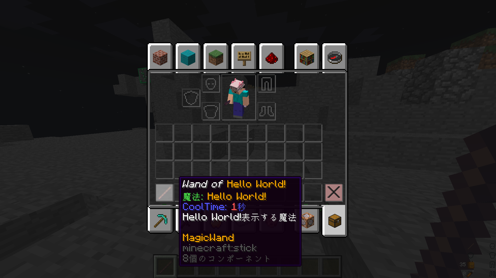
```
チャットに「Hello World!」を出力する魔法。
クールタイムは1秒。
サバイバル鯖内で特定の行動をすると貰えます。
チュートリアル的アイテム。
```
#### Wand of Magic Missile
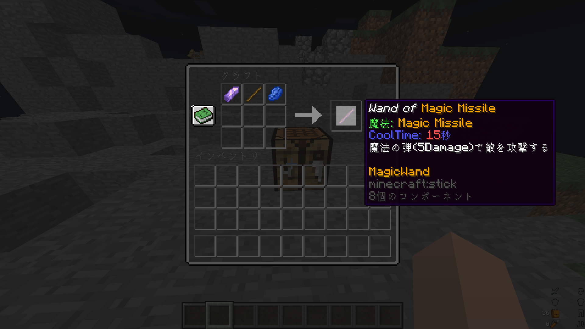
* アメジストの欠片
* 棒
* ラピスラズリ
```
魔法の弾を発射する魔法。
当たったエンティティに5ダメージ与える。
クールタイムは15秒。
書いてないけど20m先まで届くよ！
```

### ツール系
便利なアイテムです。
#### Grapple
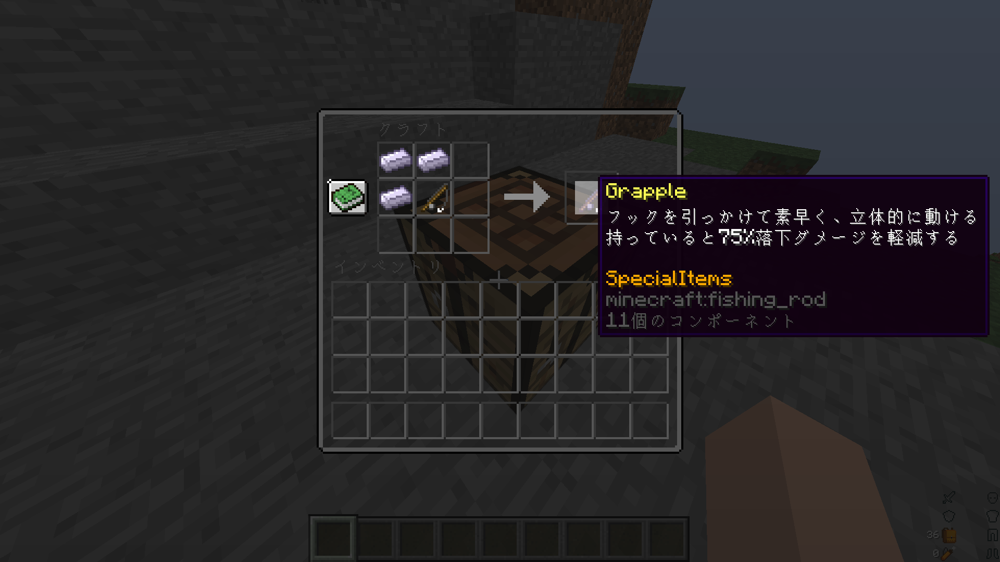
* [Enchanted Iron Ingot](#enchanted-iron-ingot) ×3
* 釣り竿
```
移動系アイテム史上最強のアイテム
床、壁、天井があれば引っ張ることで飛ぶことができる
これがあるかないかだけでQOLが大きく変わる
```

### 素材系
中間素材
#### Enchanted Coal
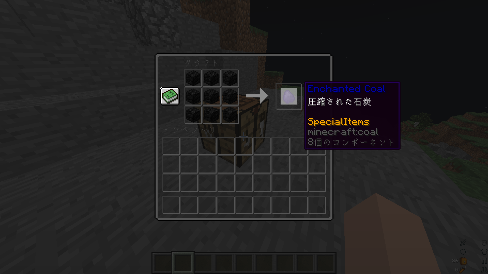
* 石炭ブロック ×9
```
石炭ブロックの圧縮！
燃料として使うのはやめようね、もったいないよ。
```
#### Enchanted Coal Block
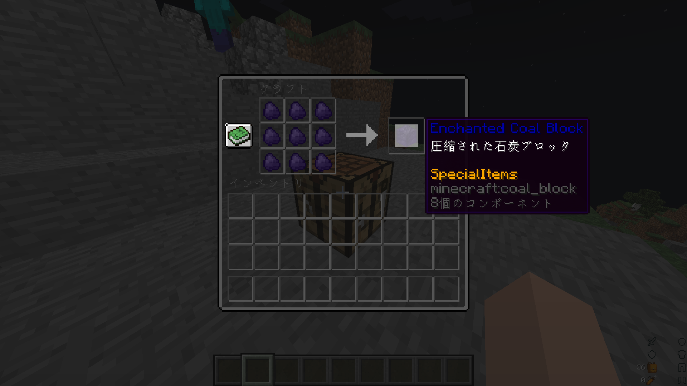
* [Enchanted Coal](#enchanted-coal) ×9
```
更に圧縮！
燃料として使うのはやめようね、本当にもったいないよ。
```
#### Enchanted Emerald
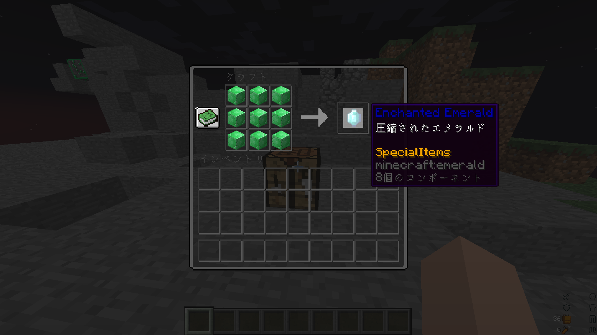
* エメラルドブロック ×9
```
エメラルドブロックの圧縮！
村人の取引に使うのはやめようね、もったいないよ。
```
#### Enchanted Emerald Block
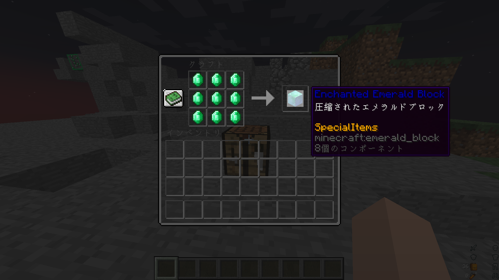
* [Enchanted Emerald](#enchanted-emerald) ×9
```
更に圧縮！
```
#### Enchanted LapisLazuli
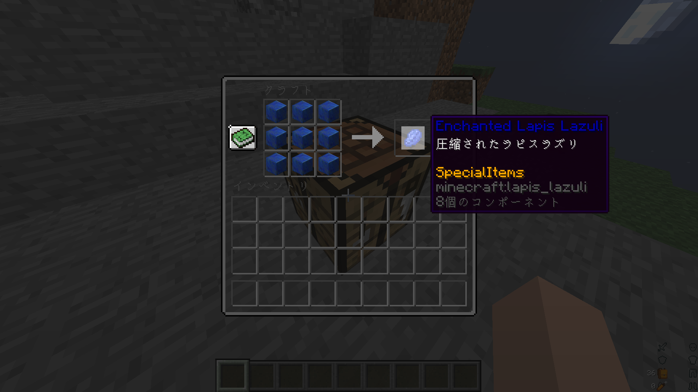
* ラピスラズリブロック ×9
```
ラピスラズリブロックの圧縮！
エンチャントに使うのはやめようね、もったいないよ。
```
#### Enchanted LapisLazuli Block
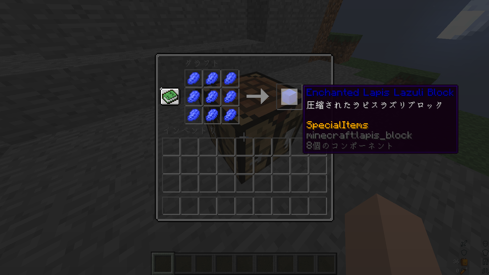
* [Enchanted LapisLazuli](#enchanted-lapislazuli) ×9
```
更に圧縮！
```
#### Enchanted Diamond
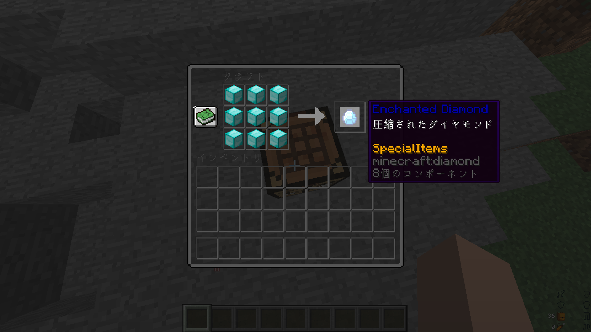
* ダイヤモンドブロック ×9
```
ダイヤモンドブロックの圧縮！
噛んだら歯が欠ける！
```
#### Enchanted Diamond Block

* [Enchanted Diamond](#enchanted-diamond) ×9
```
更に圧縮！
嚙んだら更に歯が欠ける！
```
#### Enchanted Iron Ingot
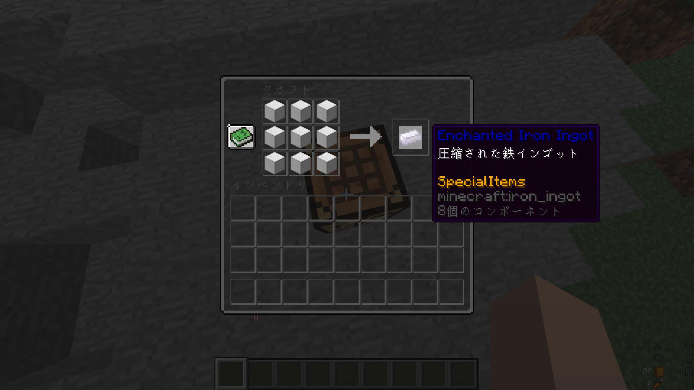
* 鉄ブロック ×9
```
鉄ブロックの圧縮！
アイアンゴーレムの修復に使うのはやめようね、もったいないよ。
```
#### Enchanted Iron Block
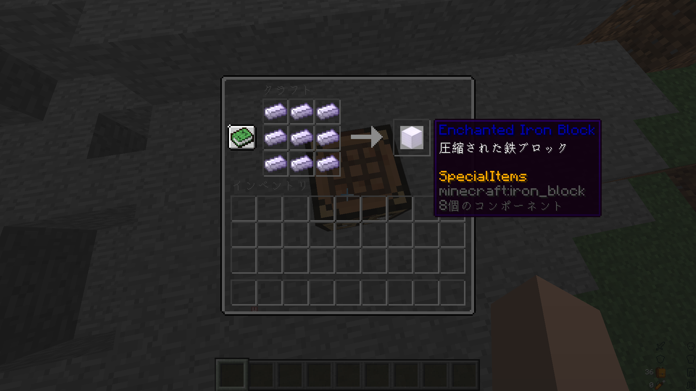
* [Enchanted Iron Ingot](#enchanted-iron-ingot) ×9
```
更に圧縮！
```
#### Enchanted Copper Ingot
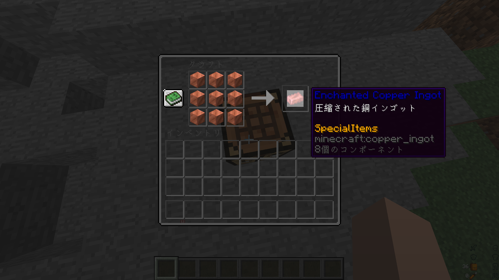
* 銅ブロック ×9
```
銅ブロックの圧縮！
銅ってあんま使い道ないよね。
```
#### Enchanted Copper Block
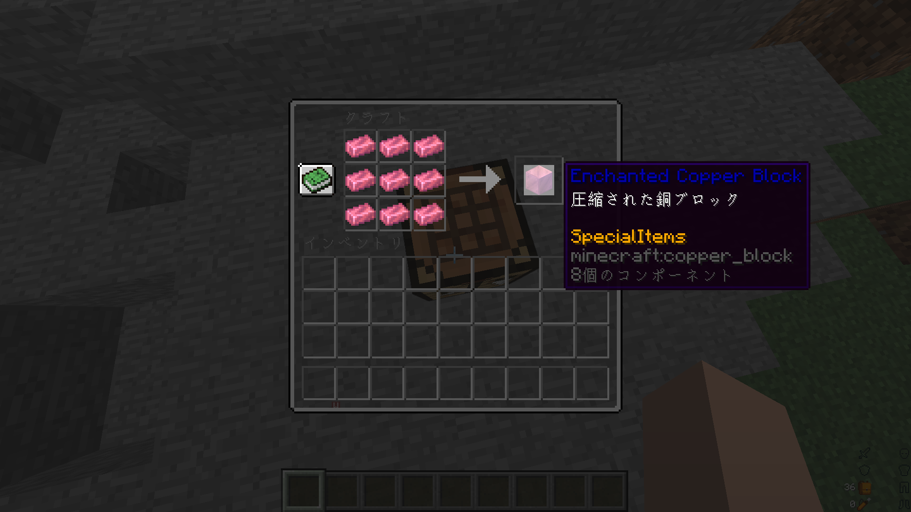
* [Enchanted Copper Ingot](#enchanted-copper-ingot) ×9
```
更に圧縮！
なんども言うけど銅ってあんま使い道ないよね。
```
#### Enchanted Gold Ingot
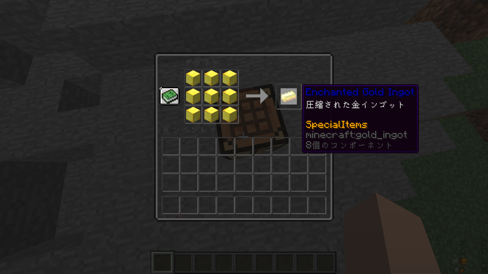
* 金ブロック ×9
```
金ブロックの圧縮！
金の価値上がってるらしい。
```
#### Enchanted Gold Block
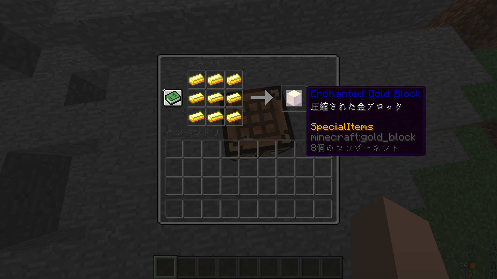
* [Enchanted Gold Ingot](#enchanted-gold-ingot) ×9
```
更に圧縮！
言ってなかったけど、取引に使うのはやめようね、もったいないよ。
```
