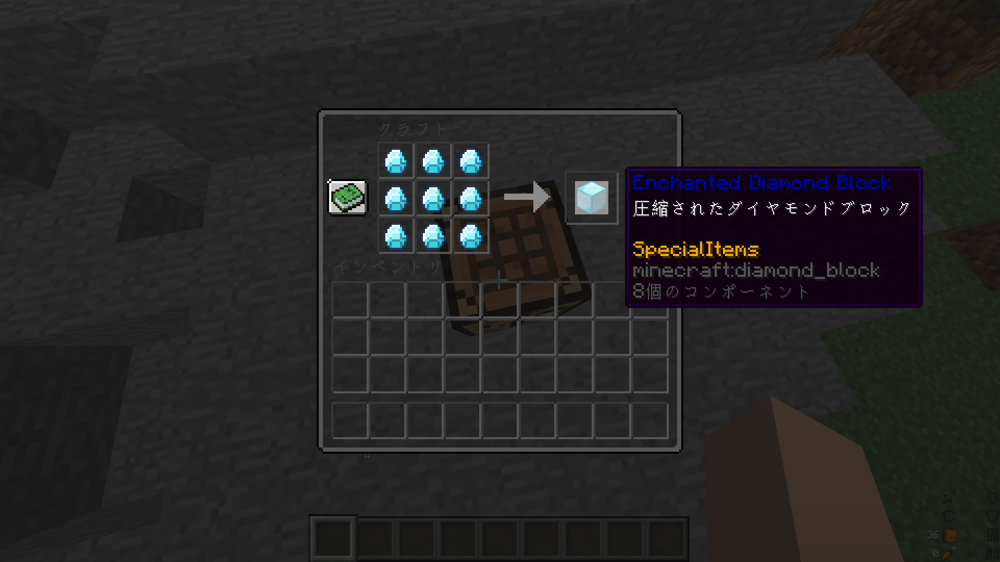

# 追加アイテム
## 一覧
### 魔法系
* [Wand of Hello World!](#wand-of-hello-world)
* [Wand of Magic Missile](#wand-of-magic-missile)
* [Wand of Fire](#wand-of-fire)
* [Wand of Gliding](#wand-of-gliding)
* [Cleaver](#cleaver)
* [Aspect of the Sculk](#aspect-of-the-sculk)
* [Wand of Bullets](#wand-of-bullets)

### ツール系
* [Grapple](#grapple)
* [Sword of Looting](#sword-of-looting)
* [Hoe of Fortune](#hoe-of-fortune)
* [Skeleton Bow](#skeleton-bow)

### 素材系
* [Enchanted Coal](#enchanted-coal)
* [Enchanted Coal Block](#enchanted-coal-block)
* [Enchanted Emerald](#enchanted-emerald)
* [Enchanted Emerald Block](#enchanted-emerald-block)
* [Enchanted LapisLazuli](#enchanted-lapislazuli)
* [Enchanted LapisLazuli Block](#enchanted-lapislazuli-block)
* [Enchanted Diamond](#enchanted-diamond)
* [Enchanted Diamond Block](#enchanted-diamond-block)
* [Enchanted Iron Ingot](#enchanted-iron-ingot)
* [Enchanted Iron Block](#enchanted-iron-block)
* [Enchanted Copper Ingot](#enchanted-copper-ingot)
* [Enchanted Copper Block](#enchanted-copper-block)
* [Enchanted Gold Ingot](#enchanted-gold-ingot)
* [Enchanted Gold Block](#enchanted-gold-block)
* [Enchanted Redstone](#enchanted-redstone)
* [Enchanted Redstone Block](#enchanted-redstone-block)
* [Sculk Core](#sculk-core)

## 仕様
### 魔法系
魔法系アイテムは基本クールタイムが設けられており、使用するたびにクールタイムが発生する。
#### Wand of Hello World!

```
チャットに「Hello World!」を出力する魔法。
クールタイムは1秒。
サバイバル鯖内で特定の行動をすると貰えます。
チュートリアル的アイテム。
```
#### Wand of Magic Missile

* アメジストの欠片
* 棒
* ラピスラズリ
```
魔法の弾を発射する魔法。
当たったエンティティに5ダメージ与える。
クールタイムは15秒。
書いてないけど20m先まで届くよ！
```
#### Wand of Fire

* ブレイズパウダー
* 棒
* ラピスラズリ
```
炎の弾を発射する魔法。
当たったエンティティを5秒間着火させる
クールタイムは15秒。
書いてないけど20m先まで届くよ！
```
#### Wand of Gliding

* ファントムの皮膜
* 棒
* ラピスラズリ
```
上にぶっ飛ぶ。
ぶっ飛んだあとは少しの間低速落下がつく。
使ってて楽しい。
```
#### Cleaver

* [Enchanted Gold Ingot](#enchanted-gold-ingot)
* 棒
* ラピスラズリ
```
対象のHPが1以下の場合貫通ダメージを与えて倒す魔法。
魔法を使って倒すとSteveの頭がドロップする。
また、剣そのものを使って攻撃した場合、どれだけ殴ってもHPが1残る。
エンチャントもできる。
```
#### Aspect of the Sculk

* [Sculk Core](#sculk-core)
* [Enchanted LapisLazuli Block](#enchanted-lapislazuli-block)
* 棒
```
SonicBoomを撃てます。
防具貫通15ダメージ！
強い！
そして長すぎるクールタイム！
```
#### Wand of Bullets

* 雪玉
* 棒
* ラピスラズリ
```
弾幕を撃てます。
ちょっと強いと思う
```

### ツール系
便利なアイテムです。
#### Grapple

* [Enchanted Iron Ingot](#enchanted-iron-ingot) ×3
* 釣り竿
```
移動系アイテム史上最強のアイテム
床、壁、天井があれば引っ張ることで飛ぶことができる
これがあるかないかだけでQOLが大きく変わる
```
#### Sword of Looting

* [Enchanted Iron Block](#enchanted-iron-block) ×2
* 棒
```
Mobが本来落とさないアイテムをドロップするようになります。
ドロップ増加を付けると抽選回数がレベル分行われます。
```
| アイテム | 入手方法 |
| :--- | :--- |
| Enchanted Iron Ingot | ゾンビから1/500でドロップ |
| Enchanted Copper Ingot | ドラウンドから1/100でドロップ |
| Enchanted Gold Ingot | ゾンビピグリンから1/1000でドロップ |
| Enchanted RedStone | ウィッチから1/500でドロップ |
| Enchanted Coal | ウィザースケルトンから1/500でドロップ |
| Skeleton Bow | スケルトンから1/500でドロップ |
| Sculk Core | ウォーデンから1/100でドロップ |
#### Hoe of Fortune

* [Enchanted Iron Block](#enchanted-iron-block) ×2
* 棒 ×2
```
ブロックから本来落とさないアイテムをドロップするようになります。
幸運を付けると抽選回数がレベル分行われます。
```
| アイテム | 入手方法 |
| :--- | :--- |
| リンゴ | 成長しきった作物から1/400でドロップ |
| 金リンゴ | オークの葉・ダークオークの葉から1/500でドロップ<br>もしくは、成長しきった作物から1/1000でドロップ |
| エンチャントされた金リンゴ | オークの葉・ダークオークの葉から1/10000でドロップ<br>もしくは、成長しきった作物から1/20000でドロップ |
#### Skeleton Bow

* [Sword of Looting](#sword-of-looting)
```
Sword of Lootingでスケルトンを倒したときに1/500の確立でドロップする。
フルチャージの状態で敵に矢を当てるとHPを1回復する。
追加でエンチャントをしたり、弓を合成して修繕するとは不可能。
```

### 素材系
中間素材
#### Enchanted Coal

* 石炭ブロック ×9
```
石炭ブロックの圧縮！
燃料として使うのはやめようね、もったいないよ。
```
#### Enchanted Coal Block

* [Enchanted Coal](#enchanted-coal) ×9
```
更に圧縮！
燃料として使うのはやめようね、本当にもったいないよ。
```
#### Enchanted Emerald

* エメラルドブロック ×9
```
エメラルドブロックの圧縮！
村人の取引に使うのはやめようね、もったいないよ。
```
#### Enchanted Emerald Block

* [Enchanted Emerald](#enchanted-emerald) ×9
```
更に圧縮！
```
#### Enchanted LapisLazuli

* ラピスラズリブロック ×9
```
ラピスラズリブロックの圧縮！
エンチャントに使うのはやめようね、もったいないよ。
```
#### Enchanted LapisLazuli Block

* [Enchanted LapisLazuli](#enchanted-lapislazuli) ×9
```
更に圧縮！
```
#### Enchanted Diamond

* ダイヤモンドブロック ×9
```
ダイヤモンドブロックの圧縮！
噛んだら歯が欠ける！
```
#### Enchanted Diamond Block

* [Enchanted Diamond](#enchanted-diamond) ×9
```
更に圧縮！
嚙んだら更に歯が欠ける！
```
#### Enchanted Iron Ingot

* 鉄ブロック ×9
```
鉄ブロックの圧縮！
アイアンゴーレムの修復に使うのはやめようね、もったいないよ。
```
#### Enchanted Iron Block

* [Enchanted Iron Ingot](#enchanted-iron-ingot) ×9
```
更に圧縮！
```
#### Enchanted Copper Ingot

* 銅ブロック ×9
```
銅ブロックの圧縮！
銅ってあんま使い道ないよね。
```
#### Enchanted Copper Block

* [Enchanted Copper Ingot](#enchanted-copper-ingot) ×9
```
更に圧縮！
なんども言うけど銅ってあんま使い道ないよね。
```
#### Enchanted Gold Ingot

* 金ブロック ×9
```
金ブロックの圧縮！
金の価値上がってるらしい。
```
#### Enchanted Gold Block

* [Enchanted Gold Ingot](#enchanted-gold-ingot) ×9
```
更に圧縮！
言ってなかったけど、取引に使うのはやめようね、もったいないよ。
```
#### Enchanted Redstone

* レッドストーンブロック ×9
```
レッドストーンブロックの圧縮！
追加するの忘れてた。
```
#### Enchanted Redstone Block

* [Enchanted Redstone](#enchanted-redstone) ×9
```
更に圧縮！
追加するの忘れてた。
```
#### Sculk Core

* [Sword of Looting](#sword-of-looting)
```
Sword of Lootingでウォーデンを倒したときに1/100の確立でドロップする。
中間素材。
```
