# OC Survival Plugin - Version 3.0.0 アップデート情報

**OC公式サバイバルサーバー**をご利用いただきありがとうございます。
今回のバージョン 3.0.0 では、\
MPを消費して魔法が使える **Advanced Magic** アイテムの追加。\
装備・武器・魔法の性能が向上する**オリジナルエンチャント**の実装を行いました。

---

## 💎 新装備・新アイテム

### 📚 All in One
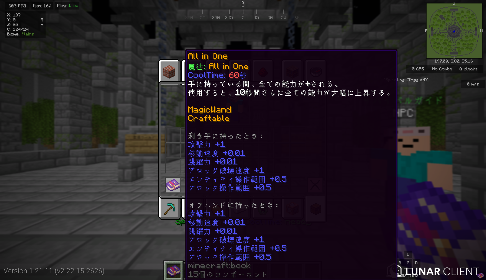
ステータスを向上させる新しいアイテム。\
正直おもちゃみたいな性能です。
- **特殊効果**: 手に持っている間、ステータスが + されます。
- **魔法**: 使用時に更にステータスが + されます。
- **入手方法**: ダンジョン内の敵全員から確率で**特殊ドロップ**として入手できます。

### 🔱 エンダー槍 (Ender Spear)
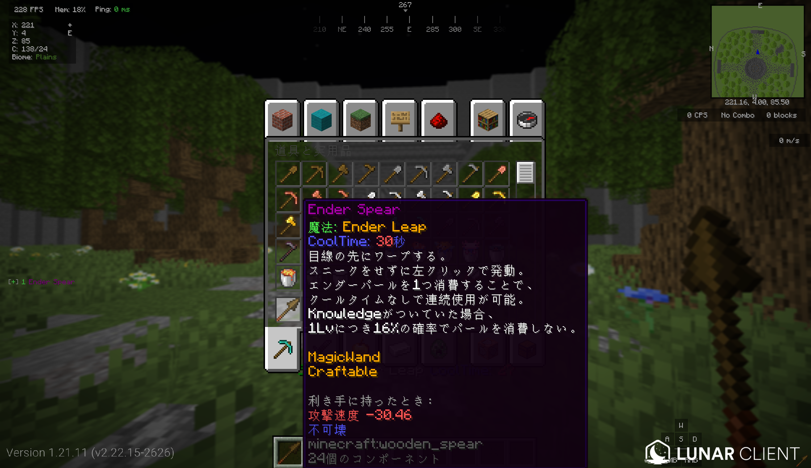\
目先に手レポートします。~~AotEのパクリとか言わない。~~\
崖などグラップルが使えない土地での、敵の真上からメイス奇襲等にご活用ください。
- **魔法**: 目先にテレポートします。\エンダーパールを消費してクールタイムなしで発動できます。\
Knowladgeのエンチャントがついていると確率でエンダーパールを消費しません！
- **入手方法**: エンダードラゴンのルートチェストから確率で入手できます。

### 🗡 ネザライトの性能を超える黒曜石の剣 (Obsidian Edge)
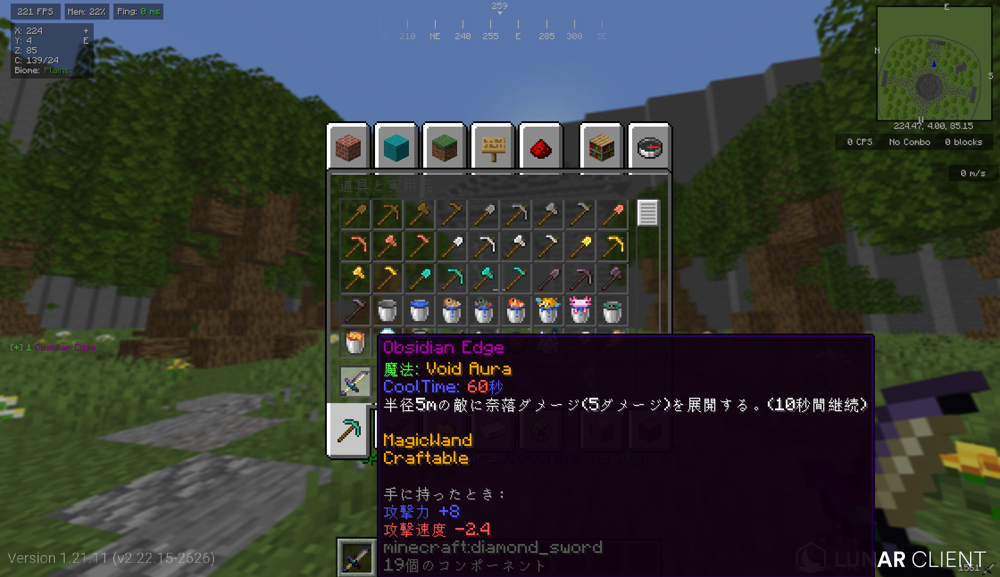\
ネザライトより、火力が1高いです！
**ただし、ネザライトのような耐火性能はありません。**
- **魔法**: 使用すると周囲に奈落ダメージを与えるオーラを展開します！
- **入手方法**: エンダードラゴンのルートチェストから確率で入手できます。

### ❤ 回復魔法！ (Wand of Healing)
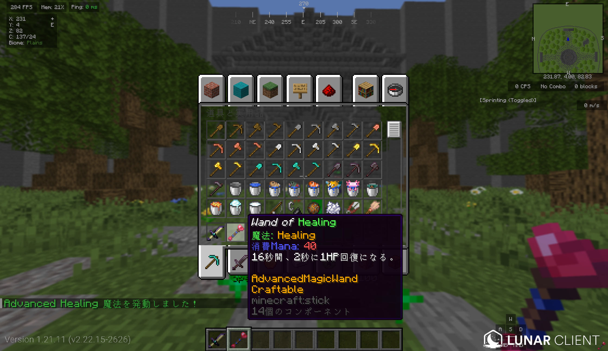\
回復魔法です！\
少しずつ回復します！
- **魔法**: 使用するとちょっとずつ回復します。
- **入手方法**: ウィザーのルートチェストから確率で入手できます。

### ❕ MPベースの新しい魔法たち！(Advanced Magic)
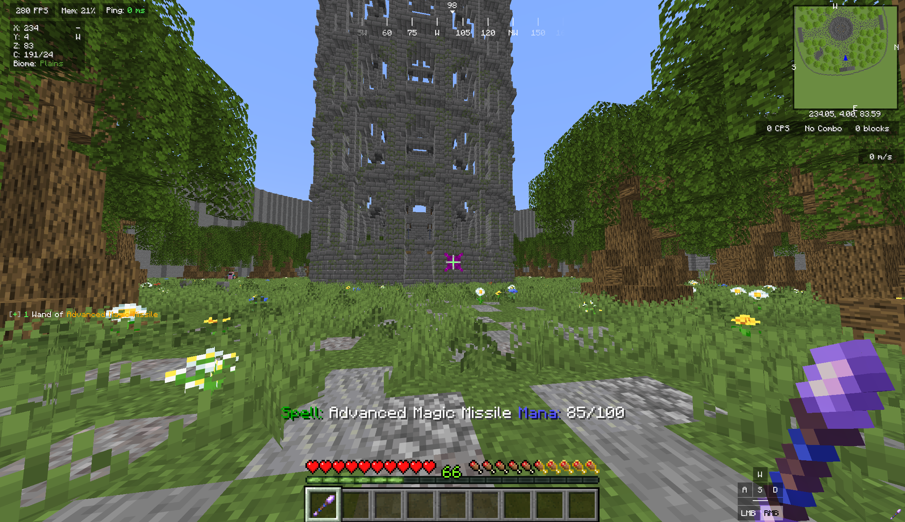\
MPを消費して魔法が使用できるものが増えました！\
また、今まで登場した魔法の杖たちも一部Advanced化させることができます！

### ❕ 特殊エンチャント本 アドバンスドアップグレード
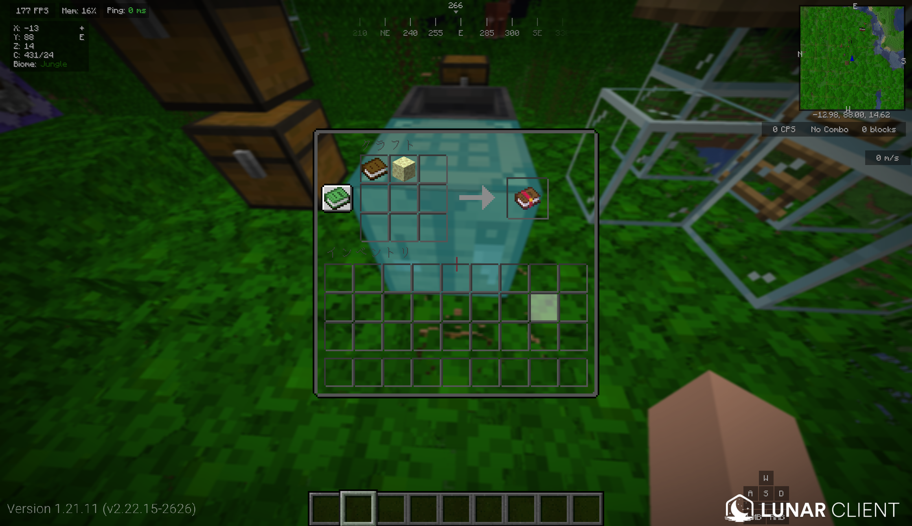\
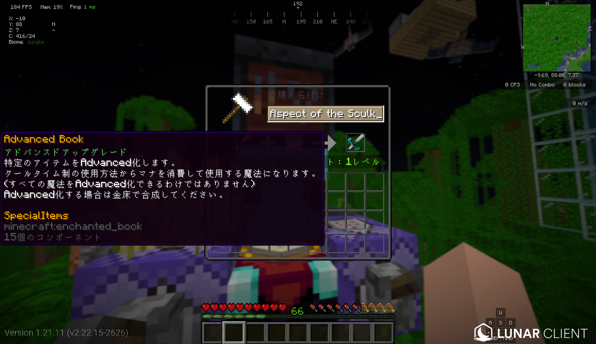\
今までの魔法アイテムをAdvanced化させるための特殊エンチャント本です！\
クラフトで入手できます。\
金床で合成することで、アイテムが変化します！\
(一部対応していないアイテムあり)

### ❕ 特殊エンチャント本 
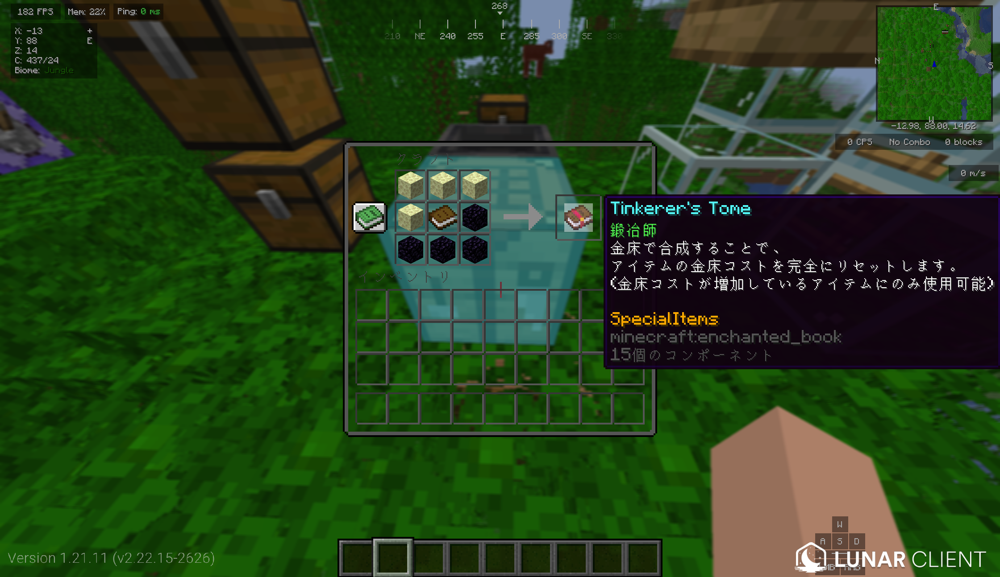
いっぱいエンチャントをつけていると「コストが高すぎます！」と表示されどうしようもなくなる時があると思います！\
そのようなときにこれをアイテムに合成することでエンチャントのコストをリセットすることができます！\
たくさんエンチャントをつけよう！\
(どれだけ修理コストが高くてもこのエンチャントをつける際には、コストが1になるようになっています！)

---

## 交換所実装
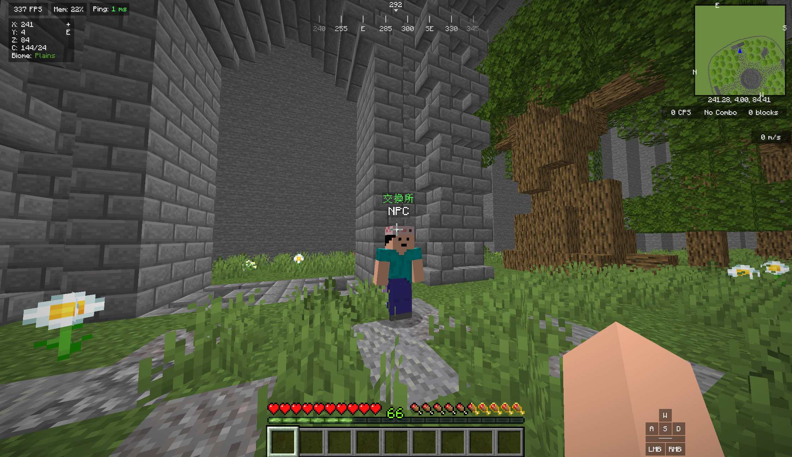\
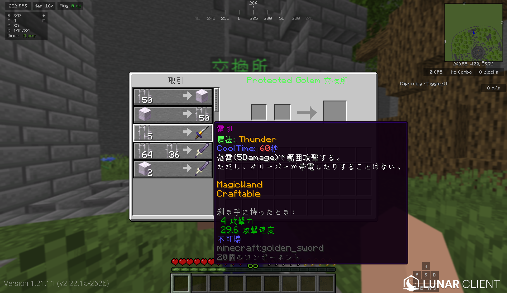\
交換所を作成しました！\
ここでは集めたトロフィーの交換や、オリジナルエンチャントの本と交換が行えます！
**交換所NPCは、サバイバルサーバーのハブのダンジョンゲート前にいます！**

---

## 📖 カスタムエンチャント実装

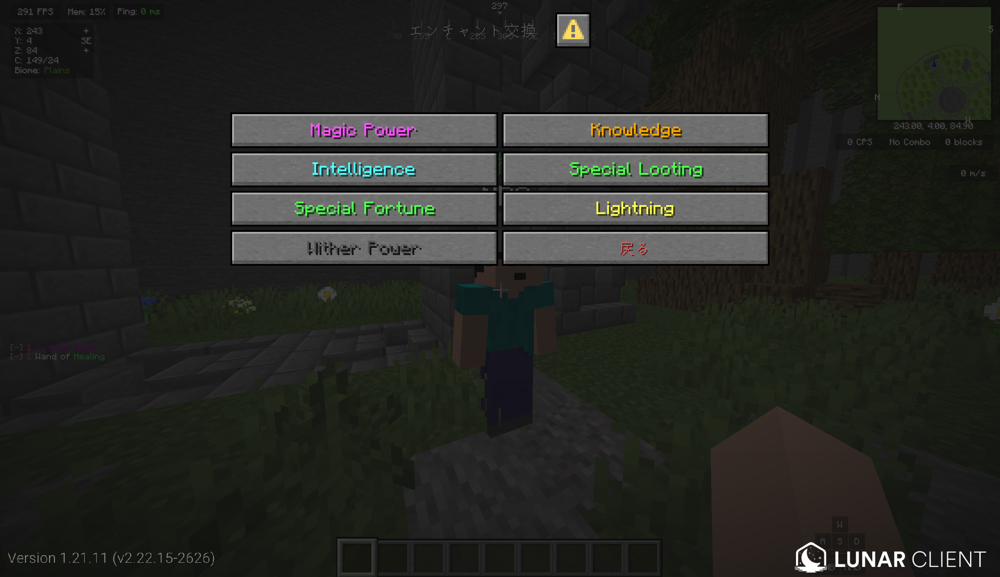\
カスタムエンチャントを実装しました。\
交換所にてそれぞれのアイテムの効果が確認できますので、ぜひのぞいてみてください！\
**交換所NPCは、サバイバルサーバーのハブのダンジョンゲート前にいます！**

---

## 🎁 追加のルートチェスト実装

エンダードラゴンとウィザーのルートチェストを実装しました。\
これらのルートチェストはそれぞれのボスを倒した際、討伐されたワールドにいるプレイヤー全員に配布されます！

---

今後とも**OC公式サバイバルサーバー**をよろしくお願いいたします！
